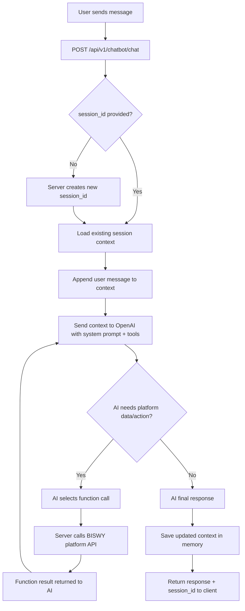

# BISWY Chatbot Workflow (PM Shareable)

## 1. Purpose
This document explains how the BISWY chatbot currently works end-to-end so Product/Project stakeholders can plan integrations, testing, and rollout.

## 2. Scope
The chatbot supports two audiences:
- Customers (retailers/dealers/distributors): product search, product details, stock checks, order help
- Business owners/admin users: sales analysis, inventory insights, low-stock and seasonal suggestions

## 3. Current Architecture Snapshot
- Backend: FastAPI server
- AI Engine: OpenAI Chat Completions with function calling
- Session Storage: In-memory (short-lived, non-persistent)
- Platform Integration: External BISWY APIs (products/orders/analytics/customers)

Important: Session history is not permanent. If server restarts or session expires, chat context is lost by design.

## 4. High-Level Workflow

## 5. Detailed Runtime Flow
1. Client calls `POST /api/v1/chatbot/chat` with `message` and optional `session_id`.
2. If `session_id` is missing, server generates UUID and starts a new conversation.
3. Chat context is loaded from in-memory store (or created if not found).
4. User message is added to context.
5. OpenAI receives:
- BISWY system prompt
- conversation history
- available function definitions
- runtime tenant context via metadata (for report calls)
6. If model decides function is needed, it triggers tool call.
7. Server executes mapped BISWY API call (product/order/analytics/customer).
8. Function result is passed back to model.
9. Model returns final user-facing response.
10. Updated context is stored in memory with TTL.
11. Response returns to client with:
- `session_id`
- `message`
- `suggested_queries` (4 follow-up prompts)
- metadata (including `session_created` true/false)

## 6. API Endpoints Used by Frontend
- `GET /api/v1/chatbot/health` - health check
- `POST /api/v1/chatbot/chat` - main chat endpoint (auto session on first message)
- `POST /api/v1/chatbot/sessions` - optional manual session creation
- `GET /api/v1/chatbot/sessions/{session_id}` - session info
- `POST /api/v1/chatbot/sessions/{session_id}/clear` - clear chat history
- `DELETE /api/v1/chatbot/sessions/{session_id}` - delete session

## 7. Session Rules (Current)
- Session is created automatically on first chat message if missing.
- Session is in-memory only.
- Session expires via TTL.
- Session does not survive server restart.
- Platform/frontend should persist returned `session_id` on client side for continuity.

## 7.1 Tenant Context Rule (Reports)
- All report APIs are tenant-scoped and require `company_id`.
- Frontend should send `metadata.company_id` in chat requests.
- Backend injects this context for report tool execution.

## 8. AI Behavior Rules (Business-Friendly Summary)
- Bot identity: "Bizwy Bot"
- Tone: professional, calm, friendly
- Always asks for missing IDs before actions
- Confirms critical actions like order creation/cancellation
- Does not fabricate API data
- Provides concise insights for owner analytics use cases

## 9. Functional Capabilities (via function calling)
- Product search
- Product details
- Product stock check
- Low stock list
- Create order
- Get order status
- Cancel order
- Sales report
- Products report
- Stock report
- Top proformas report
- Recent orders report
- Customers report
- Company health report
- Customer order history

## 10. PM Dependencies Checklist
These are required before go-live quality:
- Platform API contracts finalized (request/response/errors)
- Auth mechanism finalized (token/API key/user context)
- Role and permission mapping finalized (customer vs owner actions)
- Rate limits and SLA defined
- Error code dictionary shared
- UAT scenarios approved

## 11. Known Constraints (Current Release)
- In-memory session means no long-term persistence.
- Multi-instance deployment may lose cross-instance continuity unless sticky routing is used.
- Analytics quality depends fully on data quality from platform APIs.

## 12. Suggested UAT Scenarios
1. New user first message without `session_id` returns generated `session_id`.
2. Follow-up message with same `session_id` keeps context.
3. Missing `product_id`/`order_id` causes bot to ask for it.
4. Create/cancel order flow asks for confirmation.
5. API failure returns safe, user-friendly fallback message.
6. Session clear/delete endpoints behave as expected.

## 13. Ownership Matrix
- Frontend team: persist and send `session_id` after first response
- Platform API team: finalize contracts and auth
- Chatbot backend team: function mapping, prompt tuning, safeguards
- QA team: end-to-end scenario validation
- PM: dependency tracking, UAT sign-off, rollout gate

## 14. Rollout Plan (Practical)
1. Finalize API contracts
2. Wire exact payload mappings
3. Execute integration testing
4. Run UAT with customer + owner scenarios
5. Soft launch to limited users
6. Monitor logs/error rates
7. Full rollout

---
If needed, this document can be converted to a one-page executive summary deck format.